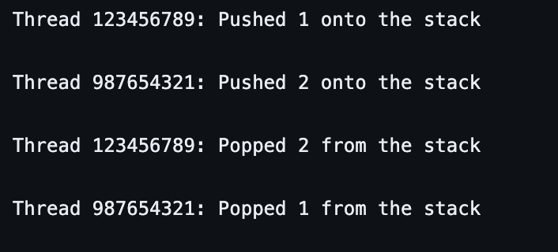

# Concurrent Stack Implementation

This is a simple implementation of a concurrent stack in C using POSIX threads (pthread library). The code allows multiple threads to push and pop elements onto and from a stack simultaneously while ensuring thread safety through mutex locks.

## Contents

- [Overview](#overview)
- [How to Use](#how-to-use)
- [Compilation](#compilation)
- [Example Output](#example-output)

## Overview

The code consists of a concurrent stack implemented using a linked list. It includes functions to initialize the stack, push elements onto the stack, and pop elements from the stack. Threads are created to perform concurrent push and pop operations.

## How to Use

1. Clone the repository:

    bash
    git clone https://github.com/Vamsishark/TDC.git
    

2. Compile the code:

    bash
    gcc -o concurrent_stack Cyberpunks_concurrent_data_structure.c -lpthread
    

3. Run the executable:

    bash
    ./concurrent_stack
    

## Compilation

The code is compiled using the GCC compiler with the `-lpthread` flag to link the pthread library.

## Example Output

The program prints messages indicating the push and pop operations performed by each thread, along with the associated data.

