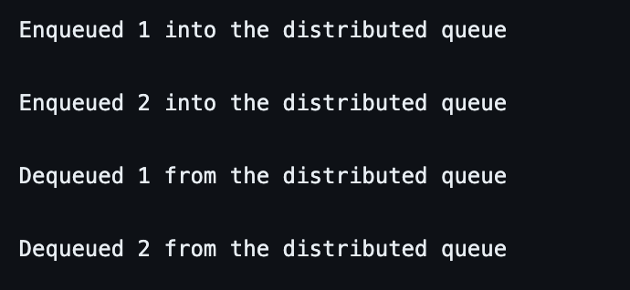

# Concurrent Stack and Distributed Queue Implementations

This repository contains simple implementations of a concurrent stack and a distributed queue in C using POSIX threads (pthread library). The code allows multiple threads to perform stack and queue operations simultaneously while ensuring thread safety through mutex locks.

## Contents

- [Concurrent Stack](#concurrent-stack)
  - [Overview](#concurrent-stack-overview)
  - [How to Use](#concurrent-stack-how-to-use)
  - [Compilation](#concurrent-stack-compilation)
  - [Example Output](#concurrent-stack-example-output)

- [Distributed Queue](#distributed-queue)
  - [Overview](#distributed-queue-overview)
  - [How to Use](#distributed-queue-how-to-use)
  - [Compilation](#distributed-queue-compilation)
  - [Example Output](#distributed-queue-example-output)

## Concurrent Stack

### Overview

The concurrent stack implementation includes functions to initialize the stack, push elements onto the stack, and pop elements from the stack. Threads are created to perform concurrent push and pop operations.

### How to Use

1. *Clone the repository:*

    bash
    git clone https://github.com/Vamsishark/TDC
    

2. *Compile the code:*

    bash
    gcc -o concurrent_stack Cyberpunks_concurrent_data_structure.c -lpthread
    

3. *Run the executable:*

    bash
    ./concurrent_stack
    

### Compilation

The code is compiled using the GCC compiler with the `-lpthread` flag to link the pthread library.

### Example Output

The program prints messages indicating the push and pop operations performed by each thread, along with the associated data.

## Distributed Queue

### Overview

The distributed queue implementation includes functions to initialize the queue, enqueue elements, and dequeue elements. Threads are created to perform concurrent enqueue and dequeue operations.

### How to Use

1. *Clone the repository:*

Skip this step if you have already did it.

    bash
    git clone https://github.com/Vamsishark/TDC
    

2. *Compile the code:*

    bash
    gcc -o distributed_queue Cyberpunks_distributed_data_structure.c -lpthread
    

3. *Run the executable:*

    bash
    ./distributed_queue
    

### Compilation

The code is compiled using the GCC compiler with the `-lpthread` flag to link the pthread library.

### Example Output

The program prints messages indicating the enqueue and dequeue operations performed by each thread, along with the associated data.

